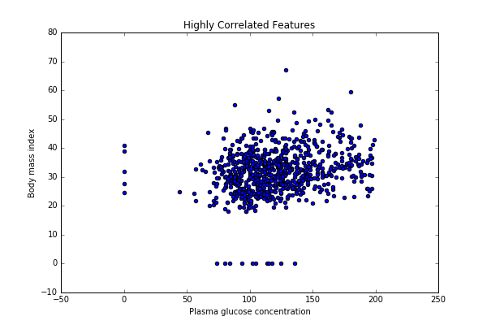

###Analysis using python in Zeppelin:
We can also do many analyis using python intrepreter(%ipython) in Appache zeppelin. For that we can use libraries like `numpy`, `pandas` and `matplotlib`. So rather than helium visualizations we can also create many more visualizations using python intrepreter as in `Jupyter Notebooks`. 
 Here I could able to make a small ploting using python libraries:
 ```
 %python
# Figure 1
plt.plot([1, 2, 3])

# Figure 2
plt.figure()
plt.plot([3, 2, 1])

 ```
 I could also able to upload CSV file using python library pandas and create scatter plot of relation between body mass index and Glucose concentration. Code is given below:
 ```
 %python
import numpy as np
import pandas as pd
import matplotlib.pyplot as plt
#%matplotlib inline
data = pd.read_csv('/home/user/Downloads/diabetes.csv')
data.head()
def visualise(data):
    fig, ax = plt.subplots()
    ax.scatter(data.iloc[:,1].values, data.iloc[:,5].values)
    ax.set_title('Highly Correlated Features')
    ax.set_xlabel('Plasma glucose concentration')
    ax.set_ylabel('Body mass index')

visualise(data)
 ```
 
 
 So, we can use Zeppelin notebook for analysis using python in future.