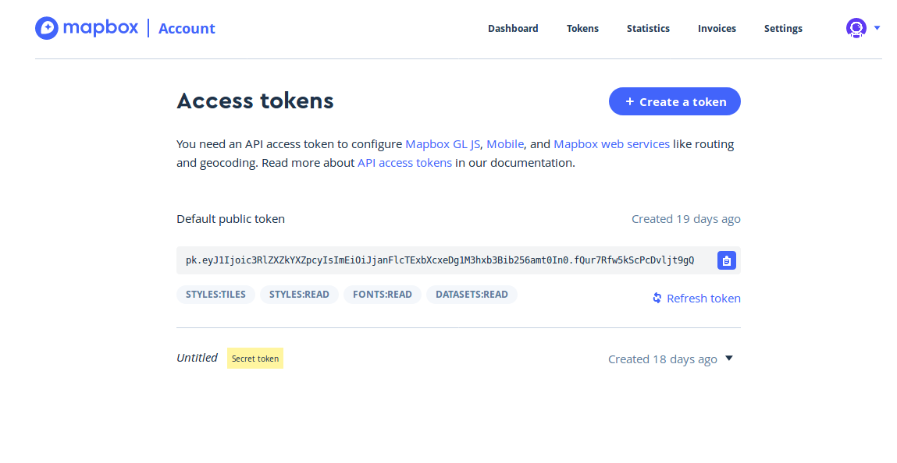

# Visualizations in Superset using Mapbox API #1

## How to set MAPBOX_API_KEY
In this cahapter what I going to do describe is about, how to create a visualization using mapbox. 
 You need to register to mapbox.com, get an API key and configure it as
``MAPBOX_API_KEY`` in ``superset_config.py``.
For that go to https://www.mapbox.com/ and sign up. 
And just copy the secret code.


Then go to conf.py file of your superset. And paste it there 
```
MAPBOX_API_KEY = os.environ.get('MAPBOX_API_KEY', '<public Key>')
```
After that, save the file and restart the superset.
Mapbox visualizations are only possible if you did this.