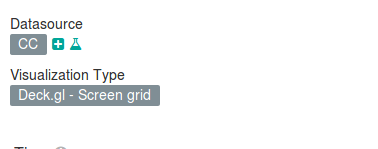
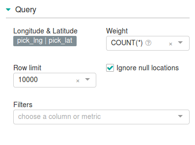
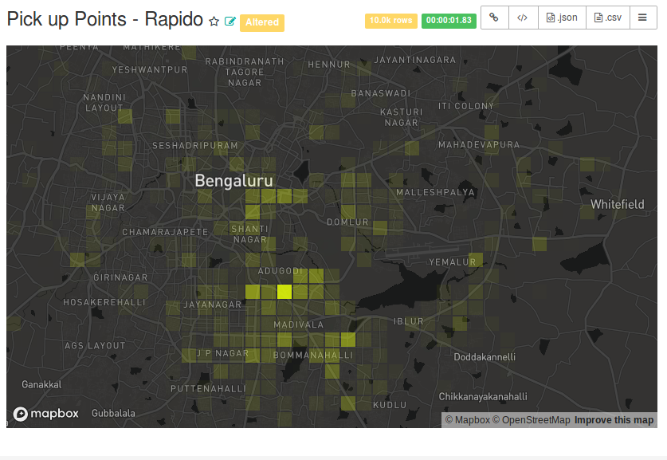
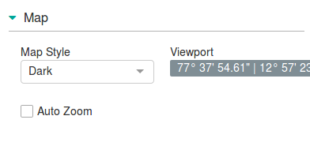

# Visualizations in Superset using Mapbox API #2

## How to do visualization in a map: example
In this cahapter I am describing, how to create a visualization using mapbox. 
 You need to register to mapbox.com, get an API key and configure the
``MAPBOX_API_KEY`` in ``superset_config.py``.

Then we need to select a table for that, here I'm selecting a 'customers_casandra' table from rapido. Next we need to select the visualization. Here I am planning to mark all the pick up points of customers of rapido. So I am choosing 'Deck.gl-Screen grid' as visualization type. 

After that go to the 'Query' section, then set latitude and longitude by selecting the corresponding coloumns.

(Note: You sholud ensure that the all the columns are made as groupable and filterable at the begenning of table creation. If not go to tables menu and choose edit option put tick marks on groupable and filterable checkboxes of corresponding coulumns. Otherwise these coloumns will not be available at the desired fields in the workspace creating a chart)

If you done all these, just click on the `Run Query` menu.
You can see the map with samll square plots.

You can edit the map properies such as colour, plotting points etc. For that go to the `map` menu which is just above the 'Adavanced' options' and make desired changes.
