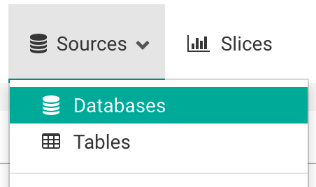
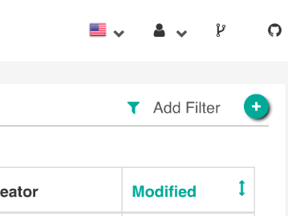
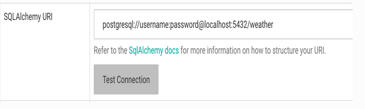
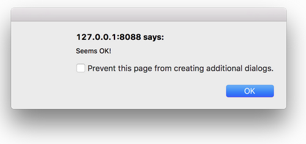

# Connecting Superset with Postgresql #2

##
In this cahapter I am describing, how to connect postgresql with superset.

### Installing pyscopg2 
Superset does not ship bundled with connectivity to databases, except for Sqlite, which is part of the Python standard library. You’ll need to install the required packages for the database you want to use as your metadata database as well as the packages needed to connect to the databases you want to access through Superset.
For connecting postgresql  with superset we need to install the pacakage `pyscopg2`.

To install pyscopg2 I used the following code in terminal
```
pip install psycopg2
```
### Connecting with the database
Go to the Sources menu, select the Databases option:



On the resulting page, click on the green plus sign, near the top right:


You can configure a number of advanced options on this page, but for this walkthrough, you’ll only need to do two things:

 1. Name your database connection:
 
 
 
 
 2. 
    Provide the SQLAlchemy Connection URI and test the connection:
    
  
  
 This example shows the connection string for database called 'test weather'.

Click the Test Connection button to confirm things work end to end. Once Superset can successfully connect and authenticate, you should see a popup like this:

   
   
Moreover, you should also see the list of tables Superset can read from the schema you’re connected to, at the bottom of the page:

   
   
If the connection looks good, save the configuration by clicking the Save button at the bottom of the page:

   
 


