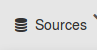
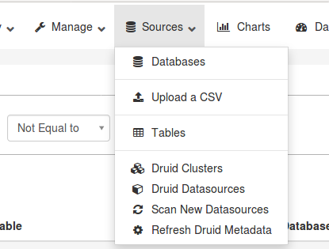
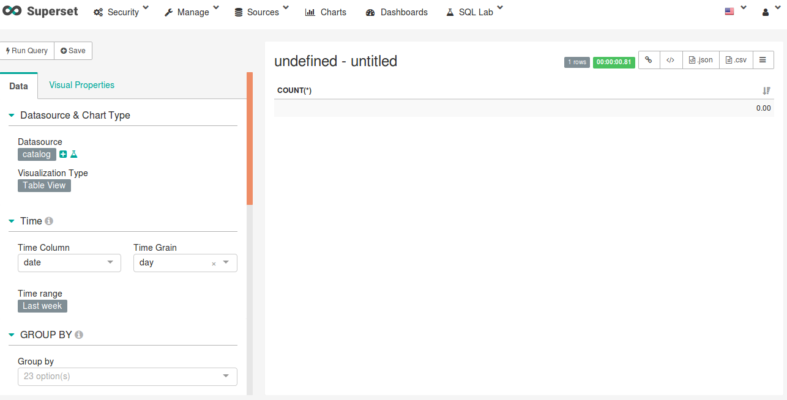
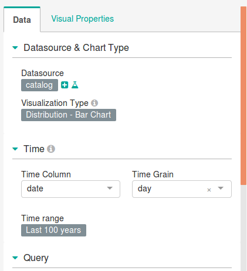
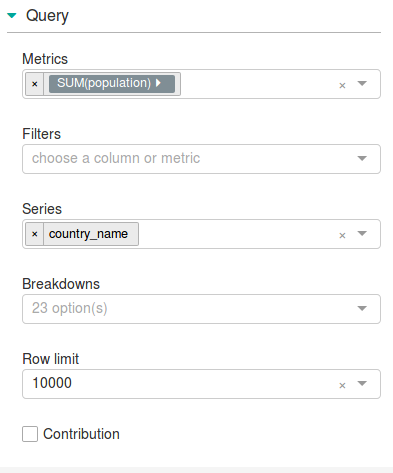
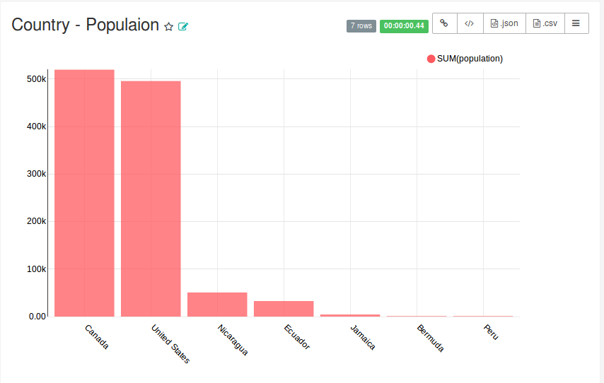

# Visualizations in Superset #1

## How to implement a bar plot diagram in Superset
In this cahapter what I going to do describe is about, how to create a simple bar chart plot in apache spark. I'll explain how I created one.
 Ok, let's start !
 First of all we need a table for this. So I am uploading a CSV file called 'catalog.csv' which I downloaded from kaggle.com. For uploading the file we need to go to the 'sources' menu 
 
 Then select the 'upload CSV' option. 
 
 Then a new window will appear, we need to set the properties and metrices for the table at here.After selecting which database to be used to store the table click Save button.
 Now the table is created using the CSV file which we uploaded. From the table list which is shown just after uploading a CSV file just select our table for visualization. So we will get a interface just like below one:
 
 Next we have to set the parameters like visualization type, Query values, Time range etc. Here we are discussing about bar plot diagram, So I am just simply going to create a graph to compare the total population in each countries.
 For that set 'Distribution-Bar Chart' as Visualization type and set time range as last 100 ago which will give a result of all the data from last 100 years. 
  
 Now we need to give the values in Query Section. Set 'Metrices' as Sum(population) and in 'Series' give the column name which you need to be in X axis. Here I am giving it as 'country_name'.
 
  
After all this, just click the 'Run Query' menu.
  
  
  
And you will get the result as like this:

 

